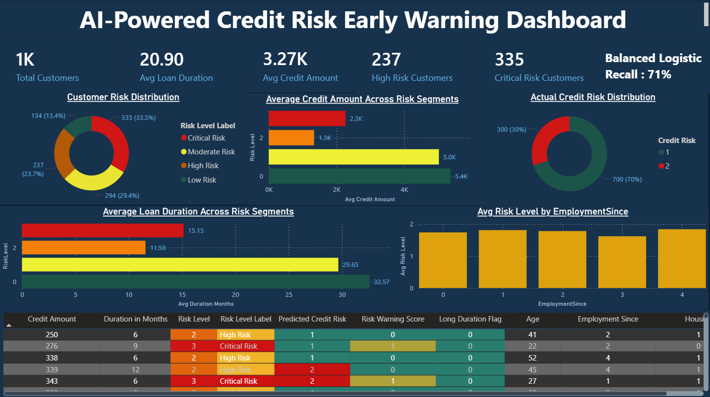
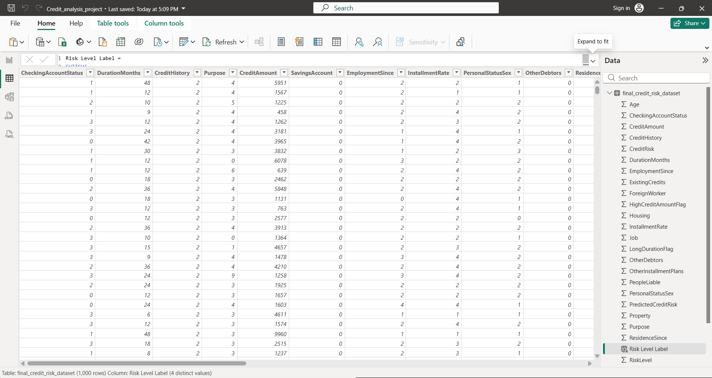

# Credit Risk Early Warning | Analytics and ML Case Study

An exploratory credit-risk case study using **Python, pandas, scikit-learn, and Power BI**. It compares several classifiers, creates a simple rule-based warning score, and presents risk segments in a dashboard.

This is a portfolio demonstration, **not a lending decision tool**. A model score should not be used to approve or deny credit without rigorous validation, fairness review, and appropriate governance.

## Dashboard

Open [the Power BI file](Credit_analysis_project.pbix) in Power BI Desktop.

## What the code does

1. Reads the included German Credit data and assigns column names.
2. Explores class balance and numeric and categorical relationships.
3. Creates three illustrative flags (credit amount above the sample median, duration above the sample median, and age under 30). Their sum forms a **hand-built warning score** with four bands. This score is separate from the trained classifiers.
4. Compares logistic regression, random forest, and class-weighted versions using an 80/20 train/test split.
5. Exports [the analysis dataset](final_credit_risk_dataset.csv) for the dashboard.

See [credit_risk_analysis.py](credit_risk_analysis.py) for the actual implementation and [the supplied data file](german.data). The README previously reported 71% recall for risky customers using class-weighted logistic regression. Treat that as a recorded run, not a guaranteed reproducible result: the repository does not include saved predictions, full metrics, or an independent validation report.

## Run locally

Install Python, pandas, Matplotlib, and scikit-learn. The current script uses `C:\credit_risk_analysis_project\Data` for input and a local Windows path for export. Set those paths to your checkout before running `python credit_risk_analysis.py`. It opens multiple interactive plots.

## Evaluation and limitations

- The script prints accuracy, confusion matrices, and classification reports. Recall for the risky class matters, but review precision and false positives too.
- Categorical encoding happens before the train/test split, and the script does not use a fitted preprocessing pipeline. Improve this before treating the result as a robust ML benchmark.
- The simple warning thresholds are illustrative; they are not calibrated probabilities.
- Document the data source and feature meanings, preserve a fixed evaluation dataset, and check subgroup performance before any real-world interpretation.

## Skills shown

Exploratory analysis, feature engineering, classification, class weighting, model comparison, and Power BI reporting.
